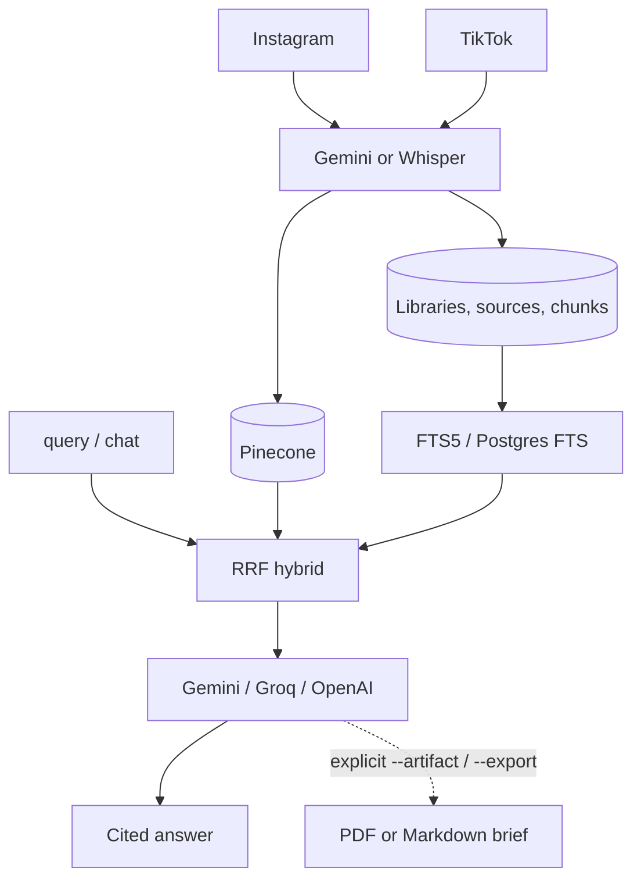

<div align="center">

# CreatorRAG

[](https://www.python.org/)
[](https://fastapi.tiangolo.com/)
[](https://www.pinecone.io/)
[](https://www.docker.com/)
[](https://opensource.org/licenses/MIT)

</div>

**CreatorRAG** (`crag`) turns **selected creator content** into a personal knowledge library. Add Instagram and TikTok sources, extract what was said and shown, then ask questions. Answers come back **cited to the original URL**.

The promise is **traceable answers from your sources**, not that a creator is objectively right. YouTube is not supported.

Details: [docs/architecture.md](docs/architecture.md) · [docs/usage.md](docs/usage.md) · [docs/api.md](docs/api.md)

### Product model

```text
User → Library → Sources (Instagram, TikTok, URL)
      → Chunks → Dense (Pinecone) + lexical (FTS) → Cited chat answer
```

Groups, saved-post import, and PDF/Markdown briefs are optional. Chat never infers a file export from wording.

---

## Quick start

```bash
uv sync --extra api
uv run crag user create me
uv run crag library create "Mis creadores"
uv run crag instagram add creator_name --library mis-creadores --max-posts 20
uv run crag tiktok add https://www.tiktok.com/@creator/video/... --library mis-creadores
uv run crag query "¿Qué recomienda sobre movilidad?" --library mis-creadores --mode strict
uv run crag chat --library mis-creadores
```

API: `POST /libraries`, `POST /libraries/{slug}/sources`, `POST /query` with `library`. Use slugs; UUIDs stay internal.

Platform commands are explicit (`instagram`, `tiktok`). YouTube URLs are rejected.

Optional formatted brief (explicit flags only):

```bash
uv run crag query "Rutina de 4 días upper/lower" --library mis-creadores \
  --artifact workout_plan -o rutina.pdf
```

`--artifact` is `workout_plan`, `recipe_book`, or `grocery_list`. `--export` / `-o` sets the path (`.pdf` or `.md`).

---

## Features

- **Library-scoped RAG** with slug + ownership checks.
- **Instagram + TikTok** ingest (profiles, posts/reels, TikTok profile discovery). Already-indexed URLs are skipped.
- **Multimodal extraction** via Gemini (`GEMINI_EXTRACTION_MODEL`, default `gemini-3.5-flash`). Whisper is audio-only.
- **Hybrid retrieval:** Pinecone + SQLite FTS5 or PostgreSQL FTS, fused with RRF.
- **Pinned embeddings** (`EMBED_PROVIDER` must match the Pinecone index for its lifetime).
- **Quota-aware Gemini:** `GEMINI_MAX_CONCURRENT_REQUESTS` (default 1) and backoff on 429.
- **Answer LLMs:** Gemini, Groq (`openai/gpt-oss-120b`; Llama 3.3 is shut down on free/developer), or OpenAI-compatible APIs.
- **Cited answers** with sanitized `[Source N]` and `timings_ms`.
- **Optional briefs** only when `--artifact` / `--export` or API `artifact_type` is set.

---

## Architecture



---

## Installation

Python 3.12+, FFmpeg on `PATH`, [`uv`](https://github.com/astral-sh/uv).

```bash
git clone https://github.com/Xan007/creator-to-rag.git
cd creator-to-rag
uv sync --extra api
```

Copy [`.env.example`](.env.example) to `.env`. Required: `GEMINI_API_KEY`, `PINECONE_API_KEY`, `APIFY_API_KEY`. Keep `EMBED_PROVIDER` and `CRAG_PINECONE_INDEX` aligned with an existing index (legacy `INSTARAG_*` vars still work as fallbacks).

Groq answers (optional):

```ini
GROQ_API_KEY=...
RAG_PROVIDER=groq
RAG_MODEL=openai/gpt-oss-120b
```

---

## CLI

Prefer `uv run crag` so you are not on a stale global install.

| Area | Commands |
|---|---|
| User | `user create`, `user list` |
| Library | `library create`, `library list`, `library add-url` |
| Ingest | `instagram add`, `tiktok add` |
| Ask | `query --library <slug>`, `chat --library <slug>` |
| Export | `query ... --artifact workout_plan -o file.pdf` |
| Legacy | `group …`, `saved import` / `saved process` |

There is no `profile` command group. Ingestion progress prints `[n/m] Downloading` / `Analyzing`.

Full examples: [docs/usage.md](docs/usage.md).

---

## HTTP API

```bash
uv run crag-api
```

OpenAPI at `http://localhost:8000/docs`. Reference: [docs/api.md](docs/api.md).

| Method | Endpoint | Description |
|---|---|---|
| `GET` | `/health` | Liveness |
| `GET` / `POST` | `/libraries` | List or create libraries |
| `POST` | `/libraries/{id}/sources` | Ingest URLs (`202`) |
| `POST` | `/query` | Grounded RAG. Optional `library`, `artifact_type` (never inferred) |
| `GET` | `/jobs/{job_id}` | Background job logs |

Legacy group, profile, and saved-post routes remain. `CRAG_API_KEY` requires `X-API-Key`. Identity: `X-User-Id` / `X-Username`.

---

## Docker

```bash
docker compose up -d --build
```

Runs as non-root `crag`, binds `$PORT` (default `8000`), stores data under `/data`, health-check `/health`.

---

## Testing

```bash
uv run pytest
```

---

## License

MIT. See [LICENSE](LICENSE).
