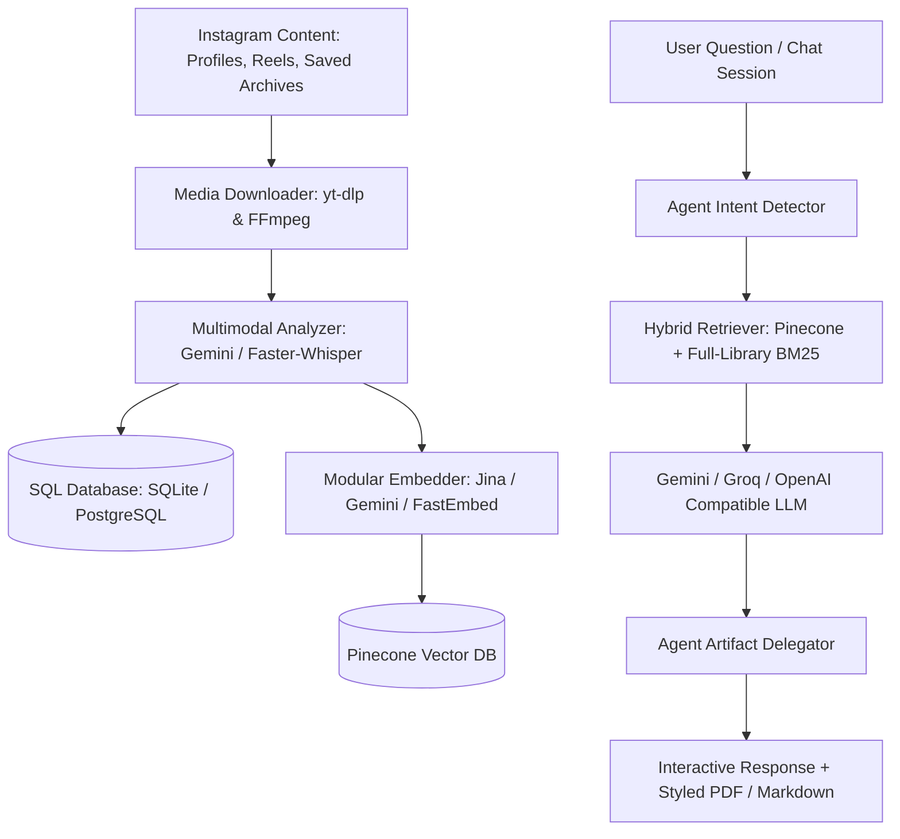

<div align="center">

# InstaRAG

[](https://www.python.org/)
[](https://fastapi.tiangolo.com/)
[](https://www.pinecone.io/)
[](https://www.docker.com/)
[](https://opensource.org/licenses/MIT)

</div>

InstaRAG is a multi-source knowledge library and Retrieval-Augmented Generation (RAG) system. A user creates a library, adds Instagram or TikTok content, and asks questions grounded in the indexed material. The CLI remains useful for local use and FastAPI exposes the product workflow.

The product promise is **traceable answers from selected sources**, not a guarantee that a creator's claims are factually correct. Answers include the original source URL so users can verify them.

### Product model

```text
User → Library → Sources (Instagram, TikTok, URL) → Chunks → Dense + lexical retrieval → Cited chat answer
```

Groups and artifact exports remain available for backwards compatibility, but they are not required for the primary library/chat workflow.

## Library workflow (recommended)

The primary workflow does not require groups. Create one personal library, add
URLs from multiple platforms, then query its ID:

```bash
instarag user create me
instarag library create "Mis creadores"
instarag library list
instarag library add-url <LIBRARY_SLUG> \
  https://www.tiktok.com/@creator/video/...
instarag query "¿Qué recomienda sobre movilidad?" --library <LIBRARY_SLUG> --mode strict
```

The equivalent API flow is `POST /libraries`, `POST /libraries/{slug}/sources`
and `POST /query` with `library`. UUIDs remain internal compatibility fields.
Jobs are serialized and can be monitored
through `/jobs/{job_id}`.

Platform commands are explicit:

```bash
instarag instagram add creator_name --library mi-biblioteca --max-posts 20
instarag tiktok add https://www.tiktok.com/@creator/video/... --library mi-biblioteca
```

The command name identifies the source platform; no platform is inferred.

### Low-cost Apify connectors

The TikTok actor is configurable through `APIFY_TIKTOK_ACTOR`. The MVP uses
`clockworks/full-tiktok-api-scraper`, with `APIFY_MAX_TOTAL_CHARGE_USD=1.00`
per run by default. Apify pricing and actor output can change; validate a
small run before production use. The platform advertises $5 monthly usage for
new accounts, subject to its current terms.

---

## Features

- **Multimodal Video & Audio Extraction:** Transcribes speech, extracts on-screen text overlays, and captures structured facts (measurements, ingredients, exercise forms, and technical steps) using Google Gemini and Faster-Whisper.
- **Hybrid Retrieval (Dense + lexical):** Combines Pinecone dense retrieval with persistent SQLite FTS5 or database-native full-text search via Reciprocal Rank Fusion (RRF), including a lexical fallback when dense retrieval is unavailable.
- **Modular Embeddings:** Jina AI v3, Google Gemini (`gemini-embedding-001`), and local FastEmbed (`all-MiniLM-L6-v2`). The active provider must remain consistent with the Pinecone index dimension.
- **Configurable extraction:** `GEMINI_EXTRACTION_MODEL` is independent from answer generation. Keep `GEMINI_EXTRACTION_FALLBACK_MODELS` empty for predictable latency, or set explicit fallbacks when availability matters more than ingestion speed.
- **Autonomous Agentic Delegation:** Automatically detects user intent to produce structured artifacts (`workout_plan`, `recipe_book`, `grocery_list`) and exports them to styled PDF or Markdown documents.
- **Executive PDF Rendering Engine:** Generates clean, minimalist documents with structured tables, direct clickable links to Instagram reels, and concise source summaries.
- **Multi-Tenant Scoped Groups:** Define isolated knowledge domains (e.g. Fitness, Cooking, Biohacking) and grant shared read permissions across accounts.
- **Deduplicated Knowledge Base:** Shared creator posts are ingested and embedded only once globally across all users and groups.
- **Production REST API:** High-performance FastAPI server with asynchronous background job workers, live log streaming, and healthcheck endpoints.

---

## Architecture



---

## Installation

### Prerequisites
- Python 3.12+ (Python 3.14 compatible)
- FFmpeg installed on system path
- `uv` package manager (or `pip`)

### 1. Clone and Install Dependencies
```bash
git clone https://github.com/your-username/instarag.git
cd instarag
uv sync --extra api
```

### 2. Environment Configuration
Create a `.env` file in the project root:
```ini
# Required API Keys
GEMINI_API_KEY=your_gemini_api_key
PINECONE_API_KEY=your_pinecone_api_key
APIFY_API_KEY=your_apify_api_key

# LLM Providers (Optional / Fallback)
GROQ_API_KEY=your_groq_api_key
OPENAI_API_KEY=your_openai_api_key
JINA_API_KEY=your_jina_api_key

# Model & Provider Configuration
EMBED_PROVIDER=fastembed         # auto | jina | gemini | fastembed; keep fixed per index
INSTARAG_PINECONE_INDEX=instarag-v2
FILTER_PROVIDER=gemini           # gemini | openai | groq
FILTER_MODEL=gemini-3.5-flash
RAG_PROVIDER=groq                # gemini | openai | groq
RAG_MODEL=openai/gpt-oss-120b    # Groq free/dev; llama-3.3-70b-versatile shut down 2026-08-16
GEMINI_EXTRACTION_MODEL=gemini-3.5-flash
GEMINI_MAX_CONCURRENT_REQUESTS=1  # throttle shared Gemini quota
INGEST_WORKERS=3                 # bounded parallelism for URL ingestion

# Database & Server Settings
INSTARAG_DATABASE_URL=sqlite:////data/instarag.db  # or postgresql+psycopg://...
PORT=8000
INSTARAG_PORT=8000
INSTARAG_HOST=0.0.0.0
INSTARAG_API_KEY=your_optional_secret_api_key
INSTARAG_CORS_ORIGINS=http://localhost:3000
INSTARAG_USER=default_user
INSTARAG_AUTO_CREATE_USERS=true
```

---

## Command Line Interface (CLI)

> [!TIP]
> Once installed globally with `uv tool install --editable .`, you can use `instarag` directly. Alternatively, use `uv run instarag <command>`.

### User Management
```bash
# Create a local user account
instarag user create <username>

# List registered accounts
instarag user list
```

### Source Ingestion
```bash
# Add an Instagram creator
instarag instagram add <creator_username> --library <library_slug> --max-posts 20

# Add a single Instagram post or reel
instarag instagram add <instagram_url> --library <library_slug>

# Add a TikTok video or profile
instarag tiktok add <tiktok_url> --library <library_slug>
```

### Scoped RAG Groups (Agents)
```bash
# Create a scoped group / knowledge agent
instarag group create <group_name> --desc "Topic Knowledge Base"

# List groups accessible to the user
instarag group list

# Add a single reel or post URL / shortcode ID to a group
instarag group add-post <group_name> https://instagram.com/reel/<shortcode>/

# Share group access with another user
instarag group share <group_name> <target_username>
```

### Saved Posts Ingestion
```bash
# Import saved posts archive (.zip export or saved_posts.json)
instarag saved import <path_to_saved_posts.json>

# Process and index imported saved posts with background workers
instarag saved process --workers 4
```

### Knowledge Query & Document Export
```bash
# General query with hybrid search
instarag query "Explain the proper technique for shoulder press"

# Query scoped to a group with autonomous PDF export
instarag query "Create a 4-day upper lower workout routine in PDF" -g <group_name> -o routine.pdf

# Query scoped to a specific creator with Markdown export
instarag query "Consolidate the ingredients for weekly meal prep" -c <creator_username> -o grocery_list.md

# Specify RAG mode ('grounded_plus' or 'strict')
instarag query "What supplements are recommended?" --mode strict --top-k 8
```

### Interactive Multi-Turn Chat
```bash
# Start an interactive conversational session scoped to a group or creator
instarag chat -g <group_name>
instarag chat -c <creator_username>
```

---

## HTTP REST API

Start the API server:
```bash
instarag-api
# or via uv:
# uv run python -m src.api.main
```
Interactive OpenAPI documentation is available at `http://localhost:8000/docs`.

### Core Endpoints

| Method | Endpoint | Description |
|---|---|---|
| `GET` | `/health` | Service health and liveness status |
| `GET` / `PATCH` | `/config` | Inspect or update global settings (`audio_only`, `engine`, `embed_provider`) |
| `GET` / `POST` | `/users` | List registered local users or create a new user |
| `GET` / `DELETE` | `/users/{username}` | Retrieve user information or delete a user account |
| `GET` / `POST` | `/groups` | List user groups or create a new scoped RAG group |
| `GET` / `DELETE` | `/groups/{group_id}` | Inspect group details and post IDs or delete a group |
| `POST` / `DELETE` | `/groups/{group_id}/posts` | Add/remove posts, reels, or profile contents to a group |
| `POST` / `DELETE` | `/groups/{group_id}/share` | Share or unshare group access with another user |
| `GET` / `POST` | `/profiles` | List registered creator profiles or register a new profile |
| `GET` / `PATCH` / `DELETE` | `/profiles/{username}` | Retrieve, update, or remove a creator profile |
| `POST` | `/profiles/{username}/reset` | Reset processing history for a creator profile |
| `POST` | `/jobs/run` | Trigger asynchronous profile ingestion background job |
| `POST` | `/jobs/add-reel` | Ingest standalone reel URLs asynchronously |
| `POST` | `/jobs/saved-process` | Trigger asynchronous saved posts indexing worker |
| `GET` | `/jobs` | List recent background jobs and worker queue state |
| `GET` | `/jobs/{job_id}` | Monitor background task progress and inspect logs |
| `POST` | `/saved/import` | Upload an Instagram export archive (`.zip` or `.json`) |
| `GET` | `/saved/status` | Retrieve import statistics and pending count |
| `POST` | `/saved/reset` | Clear processed saved posts state |
| `POST` | `/query` | Execute grounded RAG query with multi-turn history & artifact delegation |

---

## Docker & Cloud Deployment

### Build and Run Locally
```bash
docker build -t instarag:latest .
docker run -d -p 8000:8000 -v instarag_data:/data --env-file .env instarag:latest
```

### Or using Docker Compose:
```bash
docker compose up -d --build
```

### Cloud Platforms (Render, Railway, Fly.io, Google Cloud Run)
- Executes securely as a non-root user (`instarag`).
- Dynamically binds to the environment `$PORT` (default `8000`).
- Persistent data stored under `/data` (mount volume for SQLite/local caches).
- Automated container healthcheck on `/health`.

---

## Testing

Run the test suite:
```bash
uv run pytest
```

---

## License

MIT License. See [LICENSE](LICENSE) for details.
