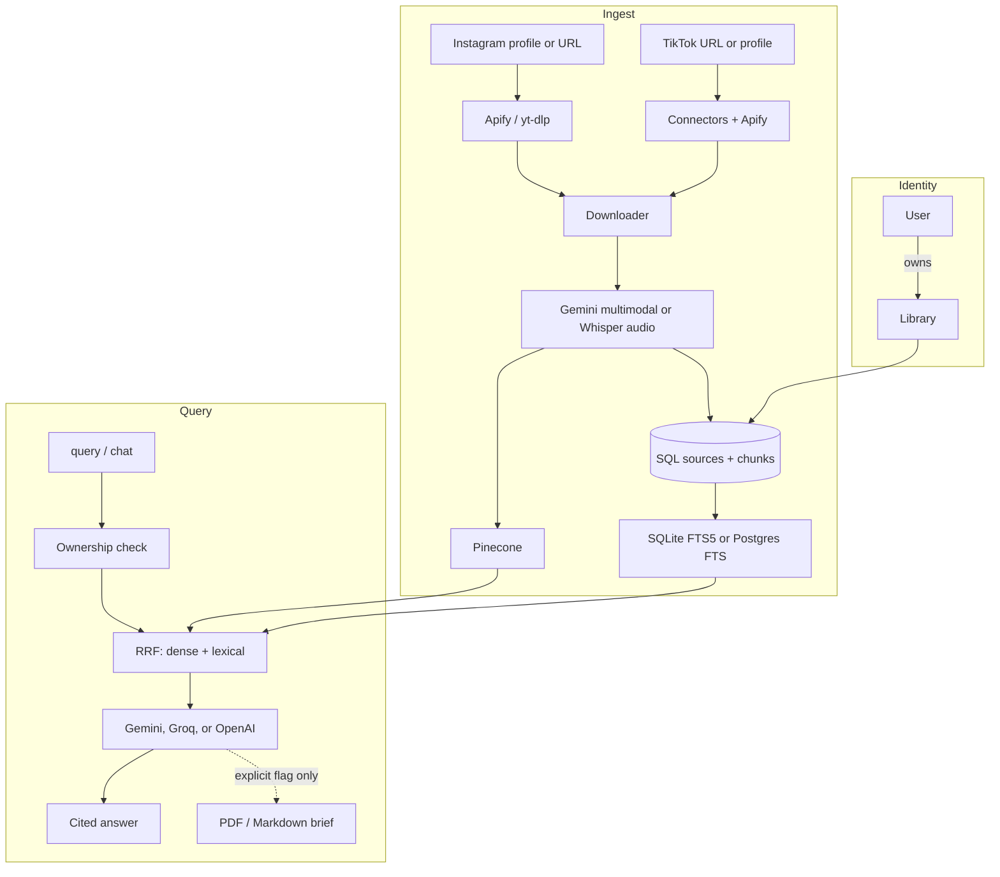

# System architecture

CreatorRAG is a **personal knowledge library**: a user owns libraries, libraries own sources, sources split into chunks, and questions are answered from retrieved chunks with citations.

The promise is **traceable answers from selected Instagram and TikTok content**, not that a creator’s claims are true. YouTube URLs are rejected.

```text
User → Library (slug) → Source (platform, url, extracted_text, ingest_status)
                      → Chunk[] → Pinecone + FTS
Question → hybrid retrieve → hydrate caption-only hits → LLM → cited answer
         → PDF/Markdown only if artifact_type or export path is set
```

Ingest is **caption-first** by default: captions are triaged with heuristics, then the RAG answer model (e.g. Groq) in the gray zone. Rich captions skip download (`caption_indexed`). Thin captions still download and run Gemini multimodal extraction (`full_indexed`).

Instagram `Post` rows remain for older ingestion paths. New work should use **Library / Source / Chunk**.



---

## Design decisions

### Libraries are the default scope

A library has a human **slug** and an internal UUID. Queries pass `library`; the service resolves it and checks `owner_id`.

### Sources and chunks

- **Source:** one URL with platform, author, caption, extracted text, `content_hash`, embedding provider/dimension, status (`pending` / `indexed` / `failed`).
- **Chunk:** retrieval unit. Re-index replaces chunks, updates FTS, and deletes stale Pinecone IDs.
- **Skip:** if the URL is already `indexed` in that library, download and Gemini are skipped.

Instagram profile scrapes still write `Post` rows and may attach `library_id`.

### Hybrid retrieval

1. Embed the question with the **same** pinned provider as the index (`CRAG_PINECONE_INDEX`).
2. Dense search in Pinecone, filtered by `library_id` or creator.
3. Lexical search over chunks (SQLite FTS5 or PostgreSQL FTS).
4. Reciprocal Rank Fusion. Lexical-only if Pinecone is missing.

Context packing groups hits by URL. Invented `[Source N]` numbers are stripped.

### Embeddings stay pinned

`EMBED_PROVIDER` must match the index dimension for the life of that index.

### Gemini quota

Extraction, Gemini embeddings, and Gemini answers share one project quota. `GEMINI_MAX_CONCURRENT_REQUESTS` (default 1) serializes those calls. Default extraction model: `gemini-3.5-flash`.

Groq is for **answers only** (`RAG_PROVIDER=groq`, default `openai/gpt-oss-120b`). It cannot analyze video.

### Optional document export

PDF/Markdown briefs are **not** inferred from chat text. Generate them only with CLI `--artifact` / `--export` or API `artifact_type`. Types: `workout_plan`, `recipe_book`, `grocery_list`. Rendering lives in `src/rag/artifacts.py`.

---

## Layout

| Path | Role |
|---|---|
| `storage/` | `User`, `Library`, `Source`, `Chunk`, plus legacy `Post`. |
| `src/connectors/` | TikTok/URL metadata; Apify TikTok actor. YouTube rejected. |
| `src/scraper/` | Instagram profile and post Apify actors. |
| `src/downloader/` | HTTP + parallel carousel download. |
| `src/analyzer/` | Gemini extraction; Whisper transcription. |
| `src/indexer/` | Chunking, embeddings, Pinecone, SQL status. |
| `src/rag/` | Lexical retriever, hybrid RRF, query engine, briefs. |
| `src/llm/` | Gemini (throttled), Groq/OpenAI factory. |
| `src/pipeline/` | Library ingest, Instagram scrape, query. |
| `src/api/` | FastAPI + background jobs. |
| `main.py` | Typer CLI. |
